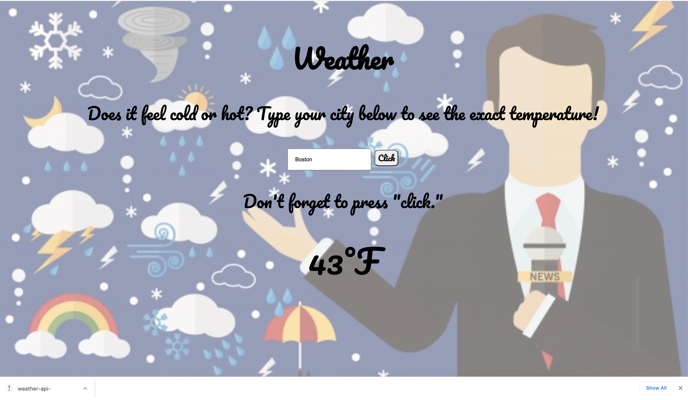

### How It's Made:
#### Tech Used: HTML5, CSS3, JavaScript

# 🌦 Project: Weather API

The goal of this project is to enable the user to enter a city + country and returns the temperature in Fahrenheit.

**Link to project:** https://weather-api-bootcamp.netlify.app/

## How It's Made:

**Tech used:** HTML5, CSS3, and JavaScript

In this project I used the Document interface and manipulated the DOM to achieve my goal. I used several Document methods to grab elements from the DOM tree. Then, I used a function along with Fetch API to fetch data to openweathermap api in JSON, and then parsed the data. After that, several document methods are responsible for manipulating DOM elements and achieve the necessary result.

## Lessons Learned:

This was the first time that I used the Fetch API to fetch external data. It was great learning how I can create useful apps by using WEB APIs. Learning to fetch data, parsing it, and manipulating the DOM is something that I feel really comfortable in now thanks to this app.
